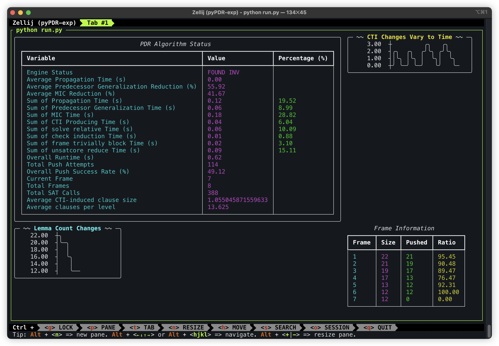

# pyPDR

## Techniques I used

### Algorithmic
- one-context-for-all-frame solver (good to re-use the solving context) [[arbrad 15]](https://github.com/arbrad/IC3ref/issues/4)
- on-demand logic cone extraction (partially implemented) [[arbrad 15]](https://github.com/arbrad/IC3ref/issues/4)
- ctgDown / Down in MIC [[Z Hassan 13]](https://www.cs.utexas.edu/users/hunt/FMCAD/FMCAD13/papers/85-Better-Generalization-IC3.pdf)
- ternary simulation - for predecessor aggresive generalization (not suitable for python implementation) [[N Een 11]](http://een.se/niklas/eff_impl_pdr.pdf)
- infinite mic attempt (suggestion from arbrad) [[arbrad 15]](https://github.com/arbrad/IC3ref/pull/6)
- literals ordering according to their appearance in the trace (frequency), both in predecessor generalization (ternary sim) and inductive generalization (mic) [[arbrad 15]](https://github.com/arbrad/IC3ref/blob/master/IC3.cpp)
- IC3 with innards for better generalization [**WIP**] [[Rohit Dureja 21]](https://ieeexplore.ieee.org/document/9617709)

### Others
- robust sanity checker
- rich console output for logging and monitoring
- cube and frame management system (add, join, push, etc.)
- unsat core extraction for inductive generalization and predecessor generalization

## Techniques I haven't tried - but should

- dynamically load the transition relation in solver
- reset solver with some frequency (keep the loaded logic relatively small)
- every time check assumption, some part (such as tr, should not be loaded every time, rather than push it to the solver at the beginning)
- use kissat or some SOTA SAT solver rather than z3
- use graceful strategy for propagating phase when solving the SAT problem (adjust the solving tactic in sovlver)
- backward ic3
- frame extending for solving SAT problem faster (mentioned in IC3, PDR and friends)
- bring in the literal add/drop info (times, etc.) to the sat solver to facilitate the solving process (CDCL, etc.)
